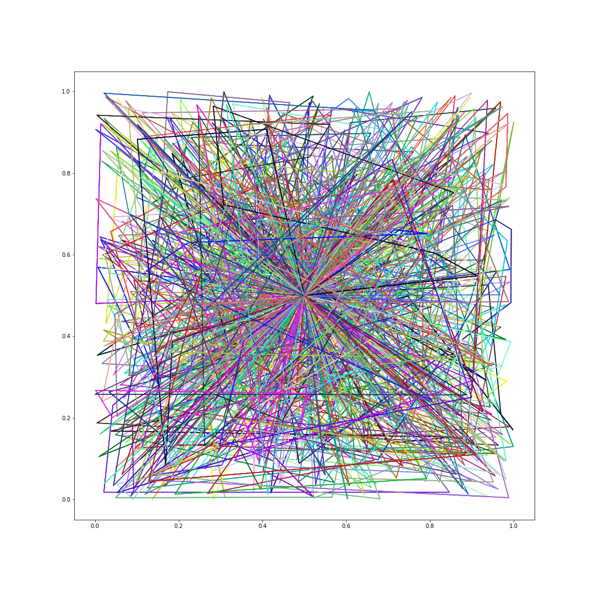
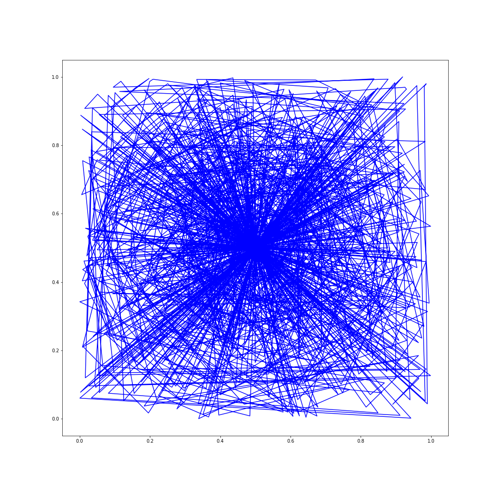

# Traveling Robot Challenge with Charging

The goal of the challenge was to visit all points between [0,1] in the shortest path I could find while recharging when the battery runs out.

In this problem, the maximum battery/charge capacity of the robot was 3 units while visiting 5000 points.

### Deconstruction of the problem statement and various approaches:

#### Plan A:
Based on the given information, we can say that from any point is 25% of the maximum charge. For a crude structure, our algorithm will start from home and look for the first point and decrement the distance from the current charge till it reaches the minimum charge point, and then go home. 

                   

The problem with this method was that points were randomly selected and so the battery consumption was not optimal at all. But this approach ensured that all points are completed with the downside of having to recharge more times

#### Plan B:
Keeping the charging situation the same, I sorted the points based on their distance from the charging station/home. This helped to select points closer charging station first and then move towards faraway points. But if the current point closer to origin was in the first quadrant, the next point may be selected in other quadrants. So the robot still had to cover more distance hence not improving the battery optimization that significantly. 

                   


#### Plan C - Minimum Spanning Tree (Dictionaries):
Now the plan was to overcome the issue of randomness between the current point and the next point if the current point is not home. So I created a dictionary of sorted points from the center and mapped every point from them individually. So the flow would be fining the next closest point from whatever the current point is instead of randomizing it. The issue with this algorithm was the heavy data structure (i.e dict of dict} used. 

                   

#### Plan C-1 - Minimum Spanning Tree (Arrays):
Try changing the heavy data structure and creating a 2D array based on distances between points and getting point information based on the number of columns/rows. And once the current point is accessed we can set it to max so while finding the closest point we don't visit the same point again. This plan improved the speed but took up back to the first issue of points being random. 

                   

### Implemented Approach - Minimum Spanning Tree (Dictionaries) in Batches:
I implemented Plan C with multiple batched to avoid overloading my algorithm and hence speeding the process up. for N number of points, I create N/500 i.e 10 batches, or N/1000 i.e 5 batches. In my submission, I have assigned 10 batches. This gives me output fairly fast and in an optimal range. 

                   

                   


## Instruction

```python
$ python Multi_Batch_Minimum_Spanning_Tree.py
```

### Submission by:
[Nupur Nimbekar](https://github.com/nimbekarnd?tab=repositories)
